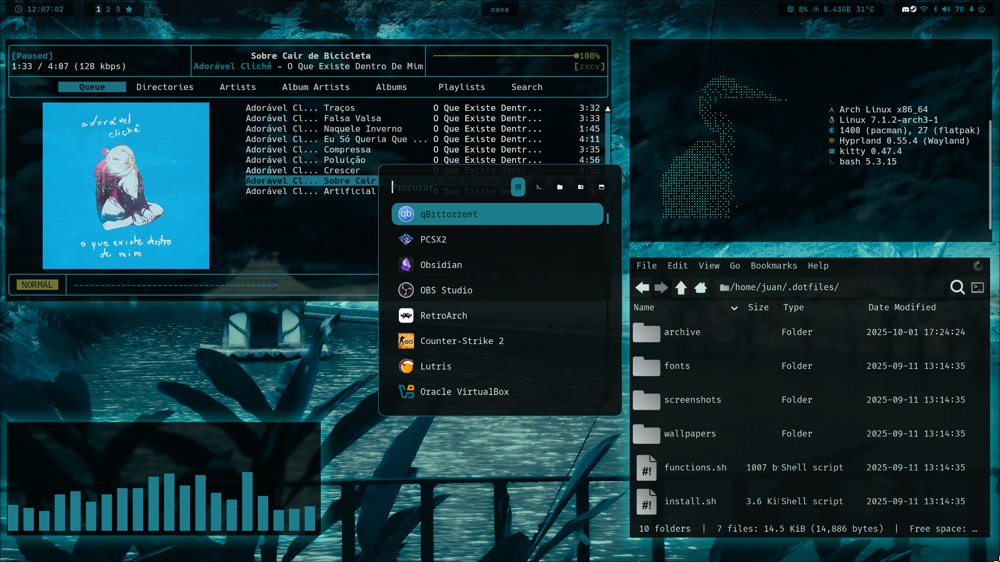
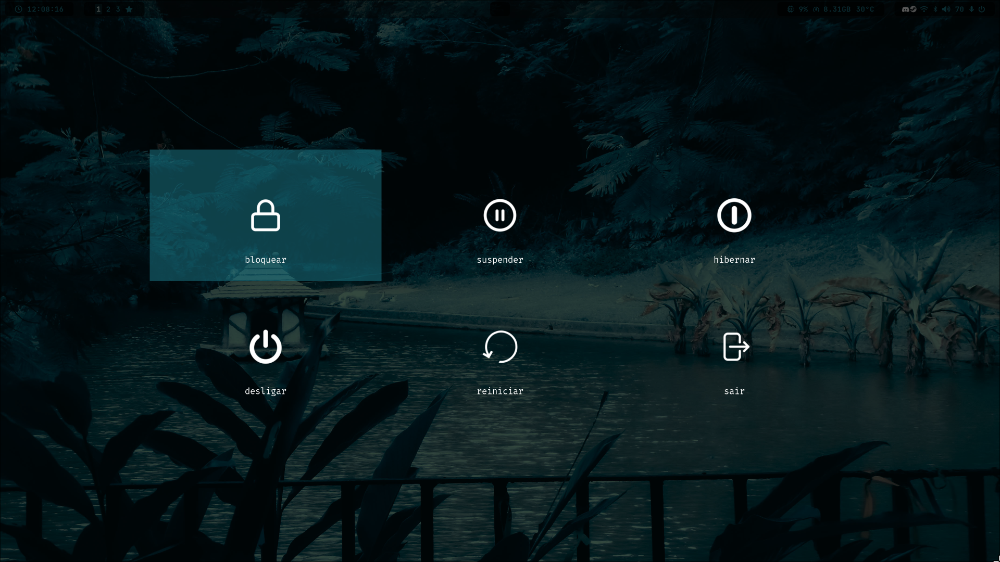

# .dotfiles do juan =)
>ヾ(•ω•`)o
<br>
<p align="center">
bem-vindo ao meu repositório de .dotfiles! aqui manterei arquivos de configuração para o meu ambiente de desktop arch linux com <b>hyprland</b> (demais ambientes encontram-se nas <i>branchs</i>).
</p>
<br>

<p align="center">
	
	
</p>

## o que eu utilizo __φ(．．)
|                 |                |
| --------------- | -------------- |
| wm              | hyprland       |
| terminal        | kitty          |
| shell           | bash           |
| prompt          | starship       |
| menu            | rofi           |
| barra de status | waybar         |
| editor de texto | neovim, vscode |
| música          | rmpc, spotify  |
| vídeo           | mpv, vlc       |

---
## teclas de atalho (＾＾＃)
|                                            |                      |
| ------------------------------------------ | -------------------- |
| abrir terminal                             | `SUPER + Q`          |
| abrir navegador                            | `SUPER + B`          |
| abrir gerenciador de arquivos              | `SUPER + E`          |
| abrir gerenciador de arquivos via terminal | `SUPER + SHIFT + E`  |
| abrir launcher de aplicativos              | `SUPER + R`          |
| alternar painel                            | `SUPER + CTRL + B`   |
| abrir área de transferência                | `SUPER + V`          |
| abrir menu de logout                       | `SUPER + L`          |
| abrir controlador de áudio                 | `SUPER + SHIFT + F1` |
| abrir gerenciador bluetooth                | `SUPER + CTRL + F1`  |
| abrir gerenciador de redes                 | `SUPER + ALT + F1`   |
| abrir selecionador de emojis               | `SUPER + .`          |
| abrir selecionador de kaomojis             | `SUPER + SHIFT + .`  |
| alternar modo minimalista                  | `SUPER + F4`         |
| abrir seletor de cores                     | `SUPER + INSERT`     |
| abrir seletor de papel de parede           | `SUPER + HOME`       |

|                                        |                                              |
| -------------------------------------- | -------------------------------------------- |
| fechar janela                          | `SUPER + C`                                  |
| matar janela                           | `SUPER + SHIFT + C`                          |
| travar janela                          | `SUPER + P`                                  |
| tela cheia                             | `SUPER + F`                                  |
| tela cheia (workspace)                 | `SUPER + SHIFT + F`                          |
| tela cheia (tiling)                    | `SUPER + ALT + F`                            |
| alternar modo flutuante                | `SUPER + X`                                  |
| alternar modo dwindle                  | `SUPER + A`                                  |
| alternar divisão de janela             | `SUPER + Z`                                  |
| alternar janela especial               | `SUPER + S`                                  |
| alternar entre janelas abertas         | `SUPER + TAB`                                |
| alternar entre workspaces              | `SUPER + ALT + LEFT / RIGHT / H / L`         |
| redimensionar janela                   | `SUPER + SHIFT + [DIREÇÃO]`                  |
| mover janela                           | `SUPER + CTRL + [DIREÇÃO]`                   |
| mover janela para workspace especial   | `SUPER + SHIFT + S`                          |
| mover janela para workspace específico | `SUPER + SHIFT + [0-9]`                      |
| mover janela para workspace vizinho    | `SUPER + SHIFT + ALT + LEFT / RIGHT / H / L` |

|                          |                                    |
| ------------------------ | ---------------------------------- |
| alternar modo grupo      | `SUPER + G`                        |
| próxima janela do grupo  | `SUPER + N`                        |
| janela anterior do grupo | `SUPER + P`                        |
| travar grupo             | `SUPER + ALT + G`                  |
| mover janela (grupo)     | `SUPER + CTRL + SHIFT + [DIREÇÃO]` |

|                              |                      |
| ---------------------------- | -------------------- |
| silenciar volume             | `SUPER + F1`         |
| diminuir volume em 1%        | `SUPER + CTRL + F2`  |
| aumentar volume em 1%        | `SUPER + CTRL + F3`  |
| diminuir volume em 5%        | `SUPER + F2`         |
| aumentar volume em 5%        | `SUPER + F3`         |
| diminuir volume em 10%       | `SUPER + SHIFT + F2` |
| aumentar volume em 10%       | `SUPER + SHIFT + F3` |
| pausar música (mpd)          | `SUPER + F5`         |
| música anterior (mpd)        | `SUPER + SHIFT + F6` |
| próxima música (mpd)         | `SUPER + SHIFT + F7` |
| diminuir volume em 10% (mpd) | `SUPER + F6`         |
| aumentar volume em 10% (mpd) | `SUPER + F7`         |

---
## como instalar \(◕ ◡ ◕\)
> [!CAUTION]
> altamente NÃO recomendado executar o script sem uma lida prévia devido à presença de pacotes de gosto extremamente pessoal e não relacionados com o _ricing_.
```shell
git clone https://github.com/juanmadeira/.dotfiles;
cd .dotfiles;
sudo chmod +x install.sh;
./install.sh;
```

## informações adicionais ( -_・)
em alguns diretórios de configuração, há a presença de arquivos ```.bak``` que, em suma, contêm os estilos que eu utilizava antes da aplicação do <a href="https://codeberg.org/explosion-mental/wallust">wallust</a>, ferramenta inspirada no desbandado pywal, que atualiza as cores do desktop conforme o papel de parede. mantive os arquivos ```.bak``` a fim de conservar as cores "estáticas" que escolhi a dedo originalmente, antes de usar essa ferramenta ヽ(~_~(・_・ )ゝ.
